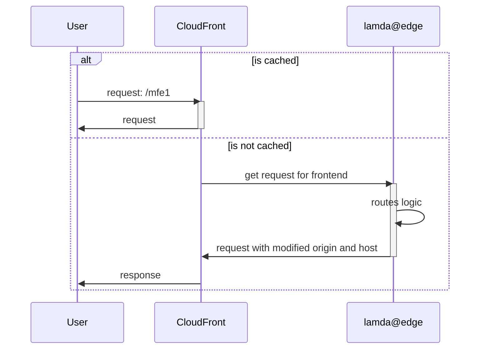

## General flow.

```mermaid
sequenceDiagram

participant A as User
participant B as CloudFront
participant C as lamda@edge

Actor A

alt is cached
    A->>B: request: /mfe1
    activate B
        B->>A: request  
    deactivate B
else is not cached
    B->>C: get request for frontend
    activate C
        C->>C: routes logic
        C->>B: request with modified origin and host
    deactivate C
    B->>A: response
end
```