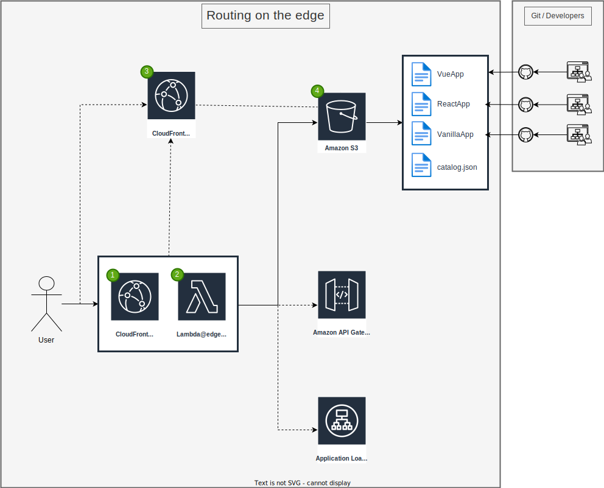

# Routing on the edge with AWS

This SAM (Serverless Application Model) template sets up an architecture to handle routing by Cloudfront and a Lambda@edge Function, which maps the incoming URL and change the origin to serve specific frontend applications from a S3 bucket.

## 1. CloudFront for the Edge (CFDistributionForTheEdge)

This CloudFront distribution is responsible for handling requests that require routing logic or feature flag management, which are executed at edge locations closer to the user.

**How it works:** It uses a Lambda@Edge function in the request view to process requests, such as determining which resource must be loaded based on the current url and catalog information. Se the specific Lambda@Edge functionality for more details.

**Automatic Versioning:** We use `AutoPublishAlias: live` to ensure that the correct version of the Lambda function is always associated with CloudFront automatically, without needing manual updates.

## 2. CloudFront Origin Access Identity (CloudFrontOAI)

This is a special identity that CloudFront uses to securely access your S3 bucket.

**How it works:** It prevents direct public access to the S3 bucket, ensuring that only requests coming through CloudFront can retrieve content.

## 3. LambdaEdge Function (LambdaEdgeFunction)

This is the main Handler of this repository,it making decisions about routing depending on the URL, here you can implement logic for feature flags, A/B testing, catalog for backend, ALB, etc.

- **Global Deployment:** Unlike standard Lambda functions, Lambda@Edge functions are deployed across AWS’s global network, ensuring fast response times for users regardless of their location.

## 4. Lambda@Edge IAM Role (LambdaEdgeRole)

This IAM role grants the Lambda@Edge function the necessary permissions to perform its tasks, such as logging and accessing S3.

- **Security:** It follows the principle of least privilege, giving the function only the permissions it needs.

## 5. CloudFront for Static Content (CFDistributionForStatics)

You may ask why we have two CloudFront distributions. This one is responsible for serving static content, such as images, CSS, and JavaScript files, while the other handles routing and feature flags.

They can not be the same distribution becouse: 
 - you will end in a while getting your catalog and other resources
 - you might need specific cache settings for each type of content when you manage static files
 - Static filew may not need to get into the routing logic.

- **Caching:** It uses caching strategies to improve performance and reduce load times for users by serving content from edge locations closest to them.

### 6. S3 Bucket (S3Bucket)

This is where the static files will be stored, micro-frontends, images, CSS, and JavaScript files.

- **Access Control:** The bucket is configured to block all public access, with a bucket policy that only allows CloudFront to retrieve files, for security reasons you may add a wait list for the cors origin configuration (CorsRules).

### 7. S3 Bucket Policy (S3BucketPolicy)

This policy explicitly allows only the CloudFront distributions to access the files stored in the S3 bucket.

- **Security:** It ensures that files can’t be accessed directly by anyone on the internet, adding an extra layer of protection.

This architecture is designed to provide a secure, scalable, and efficient way to manage and deliver micro-frontends to users globally, with the flexibility to handle advanced routing and feature flag scenarios.
